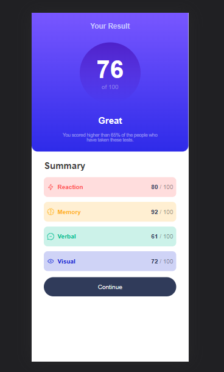

# Frontend Mentor - Results summary component solution

This is a solution to the [Results summary component challenge on Frontend Mentor](https://www.frontendmentor.io/challenges/results-summary-component-CE_K6s0maV). Frontend Mentor challenges help you improve your coding skills by building realistic projects. 

## Table of contents

- [Overview](#overview)
  - [The challenge](#the-challenge)
  - [Screenshot](#screenshot)
  - [Links](#links)
- [My process](#my-process)
  - [Built with](#built-with)
  - [What I learned](#what-i-learned)
  - [Continued development](#continued-development)
  - [Useful resources](#useful-resources)
- [Author](#author)
- [Acknowledgments](#acknowledgments)

## Overview

### The challenge

Users should be able to:

- View the optimal layout for the interface depending on their device's screen size
- See hover and focus states for all interactive elements on the page

### Screenshot

)



### Links

- Solution URL: [Add solution URL here](https://your-solution-url.com)
- Live Site URL: [Add live site URL here](https://your-live-site-url.com)

## My process

### Built with

- Semantic HTML5 markup
- CSS 3
- Flexbox


### What I learned

As with the my previous project, I struggled with CSS. The difference between now and then was the how I applied the ideas I had for this project. I had to ask my friends to help me out a bit and they pointed out to using rows to achieve my goal.

See below:

```html
 <div class="rows">
      <div class="row">
        <div class="icon">
          
          <b>Reaction</b>
        </div>
        <p><b>80</b> / 100</p>
      </div> 
      .....  
```
```css
.row:nth-child(1) {
    background-color: hsla(0, 100%, 67%, 0.2);
  }
  
  .row:nth-child(1) .icon b {
    color: hsl(0, 100%, 67%);
  }
  
```

### Continued development

I want to be comfortable with using vanilla css before i start using bootstrap. A few more projects and application of the flex box, grid and will go a long way

### Useful resources

- (https://hslpicker.com/#292929,0.89) - This helped me when it came to using colors. It made the whole thing easier and its very easy to use.


## Author

- Frontend Mentor - [@Keithpaul98](https://www.frontendmentor.io/profile/Keithpaul98)
- Twitter - [@Keith_Paul_Nkw](https://twitter.com/Keith_Paul_Nkw)

## Acknowledgments
I would like to thank my friends Edwin, Terence and Cliff for their help.

**Note: Delete this note and edit this section's content as necessary. If you completed this challenge by yourself, feel free to delete this section entirely.**
